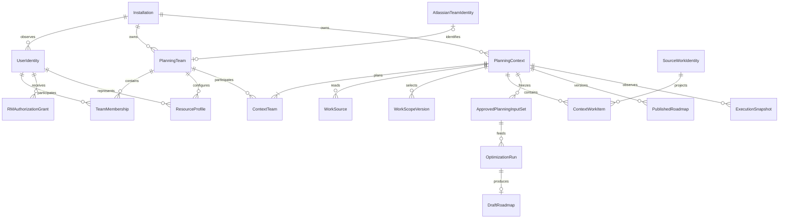
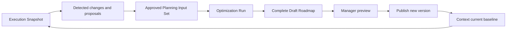

# RM Optimizer — Target Domain Model

Статус: DESIGN DRAFT, 12 сентября 2026. Сначала значения и инварианты, затем возможное хранение. Этот документ не создаёт SQL migration и не меняет текущий contract v5.
Основания: [vision](../product/PRODUCT_VISION.md), [requirements](../product/PRODUCT_REQUIREMENTS.md), [acceptance](../product/ACCEPTANCE_CRITERIA.md).

## Центр модели

**Planning Team — организационная принадлежность. Planning Context — объект планирования.**

Atlassian Team A всегда разрешается в одну Planning Team установки по stable external identity. Один Team может быть связан с несколькими Context с разными периодами/сценариями, но это не разрешение независимо обещать одну capacity дважды. MVP — одна Team в каждом Context; связь `ContextTeam` сохраняет возможность будущего multi-Team. Граница committed capacity требует D-03.

Project/board, из которого открыто приложение, помогает discovery/navigation. Он не выбирает чужое ownership, не меняет Context sources и не переопределяет текущие input revisions. Выбор B в нормальном flow открывает Context B; Team A, Context A и их история не превращаются в B.

Диаграмма показывает cardinality target, а не текущие SQL foreign keys. Для внешних identity связь действует внутри одной Installation; system не объединяет tenant по глобальному Atlassian ID.

## Общие правила идентичности и владения

Все внутренние IDs непрозрачны, стабильны и scoped Installation. Названия редактируемы и не уникальны по смыслу. Внешний Jira issue key — display/locator, authoritative identity использует stable issue ID + site/platform. Нормализованный Atlassian Team ID не зависит от проекта; исходную external representation можно хранить как provenance.

В каждой таблице словаря ниже указаны owner/scope, lifecycle, связи и устойчивость между проектами. Общее tenant правило применяется **к каждой строке**: entity принадлежит одной installation, cross-tenant references запрещены сервером и repository contract; service jobs и caches несут tenant scope. Tenant isolation не возлагается на frontend. Для installation-scoped Forge storage явный tenant column может оказаться избыточным; реализацию надо проверить, а доменный boundary сохранить.

Удаление означает archive/supersede/revoke, пока есть исторические ссылки. Физическое удаление/анонимизация относится к утверждённой retention policy D-09; оно не делает старый roadmap ссылкой на новый случайный объект. Immutable snapshots сохраняют минимальные необходимые approved inputs для объяснения результата, а не вечную копию всех Jira данных.

## 1. Tenant, identity и authorization

| Entity | Identity | Owner / scope | Lifecycle | Связи и стабильность между Jira projects |
|---|---|---|---|---|
| Installation | Внутренний installation ID + проверенный Forge installation/site binding | Tenant root; governance RM_ADMIN | PROVISIONING → ACTIVE → SUSPENDED/DECOMMISSIONING; retention отдельно | Корень Team/Context/ACL/jobs. Project move не меняет installation; новая установка/tenant не наследует права по имени |
| UserIdentity | Внутренний person ID; unique platform/site/account reference внутри installation | Installation; человек владеет собственными proposals, не grants | OBSERVED → ACTIVE/UNAVAILABLE; identity link corrections audited | Общая ссылка для нескольких Team profiles и actual assignee history. Observed user не membership/authorization. ID стабилен across projects; account IDs не telemetry |
| RMAuthorizationGrant («RM authorization membership») | Grant ID + subject identity + scope kind/ID + capability/role | Installation governance; Team/Context scoped grants | PENDING_FINALIZATION → ACTIVE → REVOKED/EXPIRED | RM_ADMIN installation governance; RM_MANAGER Team и/или Context operations; RM_MEMBER basic Team/own-context capabilities. Явная capability VIEW_PUBLISHED по D-06. Не зависит от Jira project role/profession/platform sync |
| BootstrapDecision | Operation/decision ID, installation ownership revision | Installation; проверенный authority D-04 | REQUESTED → VERIFIED → COMMITTED либо REJECTED/EXPIRED | Назначает первый grant, хранит основание без credential secret. После ownership обычный ACL authoritative. Project admin credential — evidence, не новый owner |
| AuditEvent | Event/operation ID, actor/subject references, scope/revision | Installation; защищённое governance/audit хранение | APPENDED → retention expiry; не переписывается как бизнес-объект | Ссылается на Team/Context/Run/decision; project-independent. Доступ к audit отдельно от runtime logs и от общего RM_ADMIN business read |

RM role не заменяет Jira issue visibility. Grant Team management не даёт publish каждого Context, использующего эту Team. Context Manager может планировать с предоставленным Team data access, но не менять Team membership без отдельной Team capability. Обычный user не становится Manager ни через discovery, ни через self-enrollment.

## 2. Team, membership и resource

| Entity | Identity | Owner / scope | Lifecycle | Связи и стабильность между Jira projects |
|---|---|---|---|---|
| PlanningTeam | Внутренний Team ID; опциональный unique normalized externalTeamId | Installation, управляется Team Managers | ACTIVE → ARCHIVED; legacy binding отдельно | Организационная команда; directory/request policy D-13 задаётся явно. `originProjectId` может быть provenance, не ownership. Same external ID across projects = same Team; manual Team имеет собственный внутренний ID |
| AtlassianTeamIdentity | Platform + normalized stable externalTeamId внутри installation | External platform authority; RM хранит минимальное зеркало | DISCOVERED → LINKED; renamed/unavailable не меняют ID | 0..1 link от Planning Team, уникален в tenant. Display name, Team field, Jira Project/board не идентичны этой сущности |
| TeamMembership | Team ID + UserIdentity ID + provenance/record ID | Team; утверждённые Team decisions и platform evidence | ACTIVE/INACTIVE records, effective dates; exclusion ACTIVE/REVOKED | Источники PLATFORM, MANAGER_ADDED, APPROVED_JOIN; EXCLUSION имеет приоритет. Alice в A не член B; одинаковая UserIdentity не объединяет relations |
| MembershipSource | Source ID/generation для Team; MANUAL или ATLASSIAN_TEAM reference | Team | CONFIGURED → SYNCING → SUCCESS/UNAVAILABLE/PARTIAL; generation при source mutation | Членство отделено от external Team identity и WorkScope. Manual fallback сохраняет identity. Full same-source snapshot заменяет только platform layer; change invalidates previous generation |
| JoinRequest | Request ID, Team ID, requester identity, pending dedup key | Team; requester предлагает, Manager решает | PENDING → APPROVING → APPROVED; либо REJECTED/WITHDRAWN; completion fence | Approval creates membership + explicit RM_MEMBER grant; оба effective после committed operation. Не выводится из assignee; across-project entry не создаёт duplicate request |
| PlanningRole | Stable role ID; label/description versioned | Installation catalog по D-08 | ACTIVE → ARCHIVED; merge только explicit review | Developer/QA и т. п.; profile и work requirement references. Не RM role/Jira project role. Project-specific source mapping может ссылаться на общий ID |
| Skill | Stable skill ID, отдельно от role | Installation catalog по D-08 | ACTIVE → ARCHIVED | Profile и requirements many-to-many. Общие имена legacy не автоматически один ID; project-independent identity |
| ResourceProfile | Profile ID, unique Team + UserIdentity | Team; approved Manager revision, own proposals Member | INCOMPLETE → APPROVED revisions; inactive при membership loss для новых планов | Primary/additional roles, skills, base capacity/calendar refs. Один человек может иметь профили A/B; значения не копируются при switch. History и UserIdentity сохраняются |
| ProfileProposal | Proposal ID, base profile revision, subject | Team; Member own или Manager input | PENDING → APPROVED/REJECTED/WITHDRAWN/SUPERSEDED | Не влияет на approved eligibility до решения. Approval creates next ResourceProfile revision, не role escalation и не publish |

Effective membership на выбранную дату/source generation:

`(active PlatformMembers ∪ approved ManagerAdditions ∪ approved JoinMemberships) − active Exclusions`.

Это множество ещё не solver resources: compiler требует approved profile, eligibility, Context allocation и соответствующую calendar capacity. Revoked RM access не удаляет actual work history; исключение из будущего planning выявляет конфликт уже начатой работы, не молча выбрасывает её. Membership и ACL меняются разными командами, а joint join approval имеет единый observable completion.

## 3. Context и источники

| Entity | Identity | Owner / scope | Lifecycle | Связи и стабильность между Jira projects |
|---|---|---|---|---|
| PlanningContext | Новый стабильный Context ID | Installation; Context Managers | SETUP → ACTIVE → ARCHIVED; readiness и running — отдельные состояния | Владеет sources/scope/mappings/horizons/policies/scenarios/versions; один current published pointer. Название, entry Project и horizon не identity. Switch только меняет active selection |
| ContextTeam | Link ID или unique Context + Team | Context с разрешением attach Team | CONFIGURED → ACTIVE → RETIRED revision | MVP ровно одна действующая Team; target допускает N. Не дублирует membership. Исторический Team link не перепривязывается из A в B при переключении; история версии сохраняет ссылку |
| ContextResourceAllocation | Context + ResourceProfile + allocation revision | Context; согласованная доступность Team | PROPOSED → APPROVED → SUPERSEDED | Задаёт разрешённую долю Team/person capacity для этого Context и периода. Не создаёт membership и не меняет Team calendar. Global person не может быть посчитан дважды, D-03 |
| WorkSource | Source ID, Context ID, Jira site/project/board references | Context; менеджер подтверждает источники | CONFIGURED → VERIFIED/UNAVAILABLE → RETIRED | Где читать. Список проектов постоянен до явного изменения D-02. Entry project — предложение source, не скрытый фильтр |
| WorkScopeVersion | Scope ID/revision + Context ID | Context | DRAFT → ACTIVE → SUPERSEDED; historical versions immutable | Что включать из sources: ATLASSIAN_TEAM_FIELD (stable Team ID + per-source stable field), BOARD_SCOPE (board filter/bounds); CUSTOM_JQL future. Независим от members/assignees |
| JiraProject | Stable site + external project ID | External Jira authority; installation reference | DISCOVERED/AVAILABLE/UNAVAILABLE/ARCHIVED | Source schema/permission container. Key/name могут меняться. Один проект обслуживает много Context, не owns PlanningTeam/roadmap |
| JiraBoard | Stable site + board ID | External Jira authority; Context WorkSource/Scope ссылаются | DISCOVERED/AVAILABLE/UNAVAILABLE | Board filter может включать несколько проектов; snapshot фиксирует используемые bounds/filter evidence. Entry board не заменяет persisted scope |
| FieldMappingProfile | Mapping ID/revision, Context + source project/schema reference | Context; templates отдельно от active binding | DRAFT → VALIDATED → ACTIVE → SUPERSEDED | Stable field/status/type IDs, transforms, units. Context хранит mapping set по каждому source, не один pointer на Team. Template adoption явная; source-specific revisions сохраняются |
| PlanningHorizon | Horizon ID/revision с Context ID | Context; snapshots copy reference | DRAFT → APPROVED → SUPERSEDED | start/targetEnd/scheduleEnd, timezone, DAY resolution. Не зависит от вызывающего проекта/браузера. Один Context может иметь последующие horizons без потери baseline |

Context identity переживает изменения scope/horizon, но такие изменения создают revisions и review impacts. Замена организационной Team уже используемого Context не является обычным switch: открывается/создаётся другой Context. Миграция существующего Context между Teams, если понадобится продукту, требует отдельного управляемого workflow, не предлагается как MVP shortcut.

## 4. Canonical work, structure и зависимости

**Разделить source identity и planning representation.** Source Jira issue один, planning overlays могут быть различны в альтернативных Context. Нельзя хранить принадлежность единственным перезаписываемым `work_items.team_id`.

| Entity | Identity | Owner / scope | Lifecycle | Связи и стабильность между Jira projects |
|---|---|---|---|---|
| SourceWorkIdentity | Stable platform/site/issue ID внутри installation | Jira authoritative; RM хранит reference | OBSERVED → AVAILABLE/UNAVAILABLE/DELETED evidence | Jira key/project/name — изменяемые attributes. Identity reused несколькими Context и history; не переносит Context overrides между ними |
| SourceObservation | Observation ID/generation + source issue reference | Installation source data с ограниченным visibility | CAPTURED → COMPLETE или PARTIAL generation; immutable snapshot content | Минимальные raw/normalized approved fields с fetchedAt/provenance; project move не создаёт новый person/work identity. Cache не предоставляет доступ без текущей authorization |
| CanonicalWorkItem / ContextWorkItem | Context + SourceWorkIdentity + canonical revision; internal manual source ID при будущем расширении | Context planning projection | CANDIDATE → VALID/NEEDS_INPUT → OUT_OF_SCOPE/ARCHIVED; execution state отдельно | Effort/value/deadline/kind/requirements/constraints overlays с source provenance. DONE/IN_PROGRESS — execution state, Selected/Deferred — run result, не mutually exclusive lifecycle |
| StructureRelation | Context + parent/child stable work refs + revision | Context projection из Jira hierarchy/explicit policy | OBSERVED → VALIDATED → SUPERSEDED | Presentation/aggregation tree. Не F2S, не membership, не automatic inclusion. Внешний ancestor может быть display reference без executable resource/value |
| Dependency | Context + directed prerequisite/successor refs + relation ID/revision | Context; source link evidence + approved corrections | DISCOVERED → INTERNAL/EXTERNAL/INVALID → SUPERSEDED | Внутренний F2S только между допустимыми in-scope endpoints. Scope change переклассифицирует relation; hierarchy не создаёт её |
| ExternalDependencyGate | Gate ID, Context + prerequisite reference + revision | Context Manager отвечает за assumption, Jira — за факт | UNRESOLVED → SATISFIED_BY_FACT/RESOLVED_BY_ASSUMPTION → STALE/SUPERSEDED | Endpoint вне Context; DONE evidence или approved completion assumption. Due Date не факт готовности. Недоступные details ограничены; successor использует explicit boundary date |
| DeliverableGroup | Group ID, Context + value-owner/work set revision | Context business planning | DRAFT → VALIDATED → SUPERSEDED | Value покрывает набор executable descendants; засчитывается один раз при полной delivery в target. Overlap/nested ownership требует решения D-05; Epic не обязательно group |
| ManualPlanningConstraint | Constraint ID/revision + Context/work/resource refs | Context Manager | PROPOSED → APPROVED → REVOKED/SUPERSEDED | Include/exclude, mandatory, assignment pin, explicit deadline/overrides. Не изменяет Jira silently; snapshot сохраняет constraint identity/reason |
| StructurePolicy | Policy ID/revision + Context, source type mapping | Context; Team template можно явно копировать | DRAFT → APPROVED → SUPERSEDED | Stable Jira type ID → EXECUTABLE/CONTAINER. Нельзя hard-code Epic или переносить решения проекта по имени типа |

Canonical effort всегда PERSON_DAYS, одинаков для eligible исполнителей. Planned start/end, platform deadline, approved hard deadline, forecast и actual timestamps/dates — разные поля с provenance; совпадение значений не даёт права переиспользовать смысл.

## 5. Capacity и hard policies

| Entity | Identity | Owner / scope | Lifecycle | Связи и стабильность между Jira projects |
|---|---|---|---|---|
| CapacityCalendar | Calendar ID/revision + Team/resource reference | Team base calendar; Context allocation задаёт доступную долю | DRAFT → APPROVED → SUPERSEDED | Week, holidays, normal-day fraction; stable при project/context switch. Calendar dates определяются явной timezone; approved snapshot сохраняет использованную версию |
| AvailabilityEvent | Event ID + UserIdentity/Team applicability, effective dates | Человек предлагает; authorized Team Manager approves | REQUESTED → APPROVED/REJECTED/WITHDRAWN; approved cancellation новой revision | Capacity-impact dates/fraction отдельно от чувствительной причины D-09. Распространение на другие Team явно согласуется, не неявное копирование. Personal identity помогает обнаружить конфликт общей capacity |
| WIPPolicy | Policy ID/revision + Context | Context, использует Team primary roles/resources | DRAFT → APPROVED → SUPERSEDED | SIMPLE default или ADVANCED effective resource/type caps; general и type одновременно. Team defaults допускаются как explicit template; Context policy не меняется при catalog rename |
| CompiledCapacity | Approved input set + resource + date | Run input projection, не редактируется человеком | COMPILED → VALIDATED; immutable | Результат calendar × fraction/allocation с availability reductions, conservative precision. Ссылается на версии источников; не новая Team membership |

Отсутствие может касаться физической доступности человека для всех команд, а Team allocation — только выделения его времени. Их нельзя механически слить. Предложение MVP: явно показывать затронутые Team/Context и не разрешать overlapping commitments одного человека до согласования D-03. Общие причины отсутствия не передаются другим менеджерам по умолчанию D-09.

WIP занимает active interval от начала до завершения, включая даты без allocation, как в существующем solver. Precedence general: resource > primary role > default; type: resource-type > primary-role-type. SIMPLE сохраняет advanced rows, но они не действуют. Hard policy revisions входят в frozen inputs.

## 6. Runs, планы и execution loop

| Entity | Identity | Owner / scope | Lifecycle | Связи и стабильность между Jira projects |
|---|---|---|---|---|
| ApprovedPlanningInputSet | Input set ID, Context ID, immutable manifest/hash | Context; Manager approval | ASSEMBLING → APPROVED либо ABORTED; не изменяется после approval | Фиксирует Team/resources/scope/sources/mappings/facts/policies/horizon/constraints и их revisions. Readiness result привязан к этому набору, не project-global |
| OptimizationRun | Run ID + Context, input hash, logical operation ID | Context; system executes authorized request | QUEUED → RUNNING → SUCCEEDED/INFEASIBLE/FAILED/CANCELLED; timeout без решения имеет отдельный outcome | Attempts/lease отдельно от logical run. SUCCEEDED result содержит FEASIBLE/OPTIMAL proof status; INVALID/UNKNOWN не INFEASIBLE. Run ссылается на baseline и solver version, не UI session |
| Scenario | Scenario ID + Context, scenario revisions | Context Manager/reviewer | DRAFT_INPUTS → SOLVING → REVIEWABLE/NEEDS_INPUT → ARCHIVED | Альтернатива planning inputs; несколько runs допустимы. Не independent organizational Team и не published commitment. Сравнение требует совместимых value/horizon definitions |
| DraftRoadmap | Draft ID + Context + verified run/result manifest | Context; reviewer управляет готовностью | MATERIALIZING → READY → STALE/REJECTED/PUBLISHED_REFERENCE | Complete assignments/allocations/deferred/carryover; результат immutable, changes идут через новый run. STALE — freshness/review marker, не переписывание output |
| PublishedRoadmap | Version ID + Context + predecessor version | Context Manager публикует; baseline хранится immutable | MATERIALIZING → COMPLETE; current/superseded определяется Context pointer | Исторический version сохраняет input/run/snapshot/review refs. Context published pointer единственный authoritative current; project entry не имеет своего competing baseline |
| RoadmapAssignment | Version/run + ContextWorkItem + resource allocation identity | Draft/Published version | MATERIALIZED; immutable после complete | Planned dates, primary assignee и daily person-days; actual history отдельно. Resource уйдёт из Team, но assignment reference не удаляется |
| ExecutionSnapshot | Snapshot ID + Context + complete source generation | Context; Jira facts authoritative, manager approvals отдельно | CAPTURING → COMPLETE/PARTIAL; completed facts immutable | Status/actual/remaining/source assignee evidence и baseline reference. Следующий snapshot добавляет факты; нет overwrite baseline. Один source observation может поддерживать несколько Context projections |
| PlanVariance | Variance ID + Context + baseline/snapshot refs | Context | DETECTED → REVIEWED/SUPERSEDED | Отличие actual/forecast от baseline отдельно от deadline performance. Это не автоматическая change approval и не доказанная user fault |
| PlanningChangeRequest | Request ID + Context и base revisions, author/system provenance | Context; Member own proposal/Manager decision | PENDING → APPROVED/REJECTED/WITHDRAWN/SUPERSEDED; application finalization при необходимости | Proposals и detected changes разделены по типу: нельзя reject подтверждённый actual как реальность, можно решить response. Approval создаёт approved inputs, не roadmap publication |
| Operation / RunAttempt | Operation ID + tenant/Context + idempotency/fencing data | Application workflow, не пользовательский planning object | CREATED → IN_PROGRESS → COMMITTED/FAILED/RECOVERY_REQUIRED; leases expire | Позволяет multi-write workflow без transaction assumption. Один logical decision/result при retries; project не idempotency boundary |

### Жизненные циклы не должны смешиваться

Факт DONE не нуждается в «разрешении быть реальным». Review определяет planning response. Pending user estimate/absence/skill proposal, напротив, не действует до approval. Новый факт может сделать draft stale; ни background sync, ни approval не меняют published pointer.

## Основные инварианты compiler/solver

1. Scope определяет candidates до рассмотрения members. Resources определяются membership/profile/allocation до рассмотрения assignees; historic assignee — execution evidence.
2. Mandatory и IN_PROGRESS остаются обязательными; DONE не потребляет будущую capacity/value. Неуместная membership removal создаёт конфликт remaining work, не её исчезновение.
3. Selected hard deadline обязателен; optional infeasible work может быть deferred. Overflow schedule честен и не прибавляет target delivered value.
4. Daily F2S: successor начинается после completion date. Assumption внешнего gate явная, deadline не заменяет её.
5. Value ownership однозначен. Group delivery не суммируется повторно с atomic descendant values.
6. Objectives строго по порядку: target delivered value, churn, earlier completion. Handover effort физический, churn penalty предпочтение; utilization только отчёт.
7. Person-day precision документирована compiler/solver; current conservative 0.25-day grid — reuse candidate, не скрытый UI multiplier. Непредставимый input валидируется/показывает округление.
8. Неизменяемый manifest включает все входы и versions. Worker output не authoritative, пока не проверены contract, references и constraints.

## Что текущая реализация смешивает

| Current abstraction | Целевое разделение |
|---|---|
| Project default Team, `team.projectId` как ownership check | PlanningTeam identity, Context ownership, Project source reference |
| `planningTeamContext` возвращает Team, frontend выбирает externalTeamId | Самостоятельный PlanningContext ID + explicit ContextTeam link; externalTeamId только identity resolution |
| Team membership source selection и выбор объекта планирования | Источник membership внутри Team vs Context switch; defensive source mutation остаётся редким safeguarded workflow |
| `resources` по Team+external user | UserIdentity + Team ResourceProfile + TeamMembership + ContextAllocation + RMGrant |
| Одна current mapping у Team, project-bound canonical item | Context source mapping set + shared source identity + Context-specific planning projection |
| Project published roadmap pointer | Context published pointer, immutable version/input/snapshot lineage |
| Team scope читает текущий проект | Context source set и versioned explicit WorkScope; entry project не граница |
| Raw API diagnostics и аудит решения | Safe telemetry отдельно от защищённого business audit |

## Переход к persistence

Нынешние tables уже выражают несколько Planning Teams, но не полноценные Context, ACL, shared source identity, per-Context overlays и безопасные publication commitments. Поэтому целевая модель потребует будущих additive migrations. Минимальность означает не переписывать membership/capacity/WIP/solver заново, а добавить отсутствующие владельцы/связи и перенести pointers без потери IDs.

Mapping legacy Team→Context не равен mapping последнего Atlassian display name→owner. У неоднозначных Cools/Legal данных сохранить IDs и snapshot, запрашивать binding review D-11; потерянную provenance нельзя вычислить из текущего assignee/имени. Подробный порядок — [gap](CURRENT_TO_TARGET_GAP.md) и [roadmap](../implementation/DELIVERY_ROADMAP.md).

Все спорные продуктовые варианты находятся в [PRODUCT DECISIONS REQUIRING OWNER APPROVAL](../product/PRODUCT_VISION.md#product-decisions-requiring-owner-approval). Здесь они не считаются утверждёнными.
