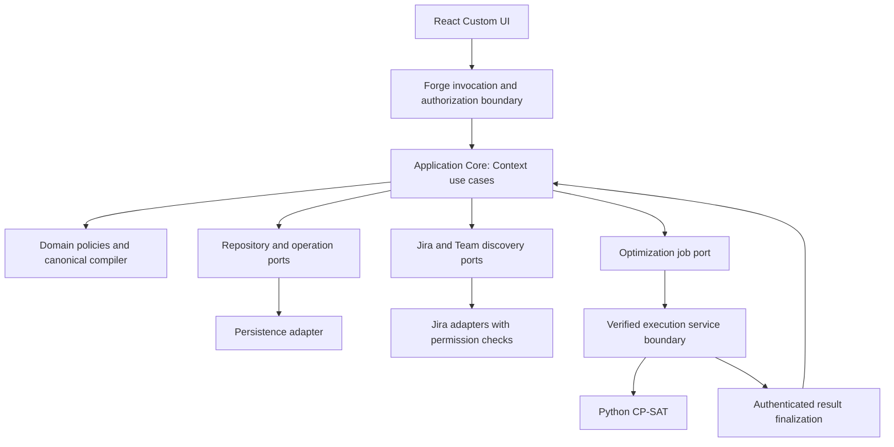

# RM Optimizer — Target Architecture

Статус: DESIGN DRAFT, 12 сентября 2026. Логическая архитектура; **не утверждение о доступности конкретного Forge hosting/queue/callback механизма**. В этом milestone меняется только документация.
Связанные документы: [domain model](DOMAIN_MODEL_TARGET.md), [requirements](../product/PRODUCT_REQUIREMENTS.md), [current gap](CURRENT_TO_TARGET_GAP.md), [delivery](../implementation/DELIVERY_ROADMAP.md).

## Архитектурное решение

Сохранить React Custom UI, vanilla JavaScript Application Core, domain/ports, Jira/SQL adapters и независимый Python CP-SAT. Ввести явный Planning Context как owner planning state; распространить его identity, ACL и revisions через все use cases. Не переносить solver в браузер, не превращать Jira Project в Team и не переписывать математическое ядро ради UI.

Worker/service здесь логическая граница. Место её исполнения выбирается после проверки runtime/time/memory, transport/auth, residency и cost. В репозитории нет готового production HTTP/queue solver service.

## Ответственность слоёв

| Layer | Делает | Не является источником истины для |
|---|---|---|
| Presentation | Context chooser, setup journeys, authorized views, readiness/inbox, progress, comparison/preview, explicit publish, accessible loading/error/empty states | ACL, effective membership, scope queries, capacity compilation, optimization result |
| Forge boundary | Проверяет invocation identity/site; resolves selected Context reference, RM capability и source visibility; whitelist commands; safe errors | Организационного ownership на основании одного projectId/discovery |
| Application Core | Оркестрирует Team/Context decisions, revisions, approval/freeze, ingest/run/publish/change lifecycle и recovery | Jira field-specific transforms или CP-SAT variables |
| Domain / compiler | Identity normalization, membership formula, structure/value/gates, eligibility/capacity/WIP, canonical validation и immutable solver manifest | Network/auth credentials/SQL layout |
| Ports | Contracts для Context/ACL/repositories, platform discovery/ingestion, job execution, operation recovery, audit/telemetry | Конкретного Forge/hosting runtime |
| Jira / Teams adapters | Получают разрешённые source facts/metadata, pagination/completeness, классифицируют unavailable/partial; не делают продуктовых approvals | RM grants, inferred membership из assignees, скрытых gate assumptions |
| Persistence | Tenant/relation integrity, unique identity, immutable versions, conditional revisions, idempotency/fencing, retention | Бизнес-решения «последнее имя Team верное», silent cross-context reassignment |
| Optimization service | Проверяет canonical request, исполняет approved solver version/budget, возвращает result+provenance, поддерживает attempts | Jira чтения, RM ACL grants, approvals, публикации, исходного scope |

Прямой frontend Jira read можно оставить для безопасных UI metadata, если permission и scope contracts соблюдены. Основной work list и solver ingestion должны идти через общий persisted Context source/scope contract, иначе вновь появятся два разных множества задач.

## Передача Context через каждый вызов

1. При входе Forge даёт доверенный installation/site/actor и Jira entry point. Backend возвращает разрешённые Context и их состояния; последний выбор — preference, не authorization.
2. Frontend выбирает `planningContextId` и передаёт его как **недоверенную ссылку**, с operation ID и expected revision для writes. Team IDs, source projects и cloud/site не принимаются как authoritative caller context.
3. Boundary загружает Context в installation, проверяет нужную capability, lifecycle, ContextTeam и WorkSource links. Team-specific command дополнительно требует Team permission, проверяет resource/profile принадлежность. Context и Team grants не взаимозаменяемы.
4. Application получает отдельный resolved execution scope: actor/installation/Context, проверенные Team/source refs, ACL/config revisions. Caller command содержит только whitelisted изменяемые поля. Нет `trustedIdentifiers, ...payload`.
5. Каждый repository operation и worker manifest связан с этим scope. Любой присланный workItem/run/profile/mapping/request ID проверяется на принадлежность scope и разрешённый lifecycle. Нельзя взять foreign ID и обновить его под текущим Context.
6. Read result несёт Context ID, config/input/baseline revisions, completeness/freshness. Frontend принимает ответ только для актуальной selection generation; caches keyed by Context+revision+visibility scope.
7. Context switch очищает old work/resource/plan view state и активирует другой набор. Form submission содержит исходные Context/revision; незавершённые edits требуют save/discard, не переназначаются новому Context.

Legacy project-based endpoints могут временно работать через **однозначное** project→legacy Context binding. При нескольких Context сервер возвращает selection required, а не первый/default Team. Compatibility adapter не позволяет обойти ACL. После cutover весь planning surface должен использовать Context; отдельный old resolver не продолжает создавать project-default Team при чтении.

## Authorization и onboarding

RM ACL хранится в приложении, identity проверяется платформой. Предлагаемый bootstrap D-04: проверенный installation authority создаёт RM_ADMIN; он явно назначает Team и Context Managers. Как получить и проверить такой credential в реальном Forge окружении — launch gate, не предположение по имени пользователя или project permission.

RM_ADMIN управляет grant lifecycle и recovery, но не получает автоматически доступ ко всем Jira issue contents/absence reasons. Team Manager управляет membership/profile/calendar только своей Team; Context Manager управляет её разрешёнными planning inputs и publication. Member предлагает собственные изменения и видит допустимый own plan; viewer capability обсуждается в D-06. Directory содержит минимум информации для join request; кто видит Team и может подать запрос, определяет утверждённая Team policy D-13.

Join approval — resumable command с одним observable completion. Membership relation и RM_MEMBER grant материализуются, но считаются effective только после committed approval record. При сбое между ними request остаётся APPROVING; повтор завершает ту же operation. Revoked/excluded user не возвращается через повтор старого approve или platform sync. Authorization проверяется и при retries, и при финальной публикации.

Jira access остаётся дополнительной границей. Наличие RM grant не даёт browse чужого проекта. Service jobs имеют явную approved execution policy, а read views фильтруются по актуальным правам пользователя; service-wide snapshot не становится общей копией скрытых issues.

## Membership identity API и fallback

Сохранить работающую discovery по stable Jira Team-field schema/type signals и нормализацию externalTeamId. Подтверждённое в проектных инструкциях ограничение: nested member account identity требует `identity:atlassian-external`, отсутствующий среди допустимых scopes. `failedGrants: []` не указывает на reinstall grant failure.

Не менять GraphQL query/scopes/Teams `asApp` наугад и не использовать API-token/Basic Auth/Teams REST. Текущий безопасный продуктовый путь — external Team identity + manager additions + pending self-enrollment/review. API unavailable — отдельный sync status, не потеря Team identity и не permission выдавать роли.

Для той же source generation только полный валидный snapshot становится новым authoritative platform layer. Partial/failed refresh сохраняет last-good. Защитная source mutation A→B сначала делает A layer неэффективным, затем сохраняет B generation; поздний A result не может примениться. Нормальный switch A/B осуществляется через Context selection и не вызывает эту мутацию.

## Cross-project ingestion и work visibility

WorkScopeVersion состоит из mode, stable selector и разрешённых WorkSources. Рекомендация D-02 — явный project set; Team-field собирает matching work из всех этих проектов, board scope использует выбранный board с согласованными project bounds. Invocation project не добавляет скрытого ограничения. В MVP CUSTOM_JQL отсутствует, arbitrary JQL payload не используется как обход sources.

Pipeline: source metadata/permission check → stable field mapping per project → paginated fetch → generation manifest/completeness → normalized source observations → Context work projection → structure/dependency classification → readiness. Unassigned Team-field work включена. Ни членство, ни assignee, ни display filter не определяют work inclusion.

Stable source identity `(installation, site, platform, externalIssueId)` переиспользуется; Context projection отдельно хранит value/effort override/requirements/kind/constraints и inclusion. Если один issue появляется в двух Context, новая ingestion не перезаписывает его единственный `team_id`. Jira project move/key rename сохраняют identity, но могут изменить scope membership и вызвать review impact.

Hierarchy imports показывают причины inclusion/exclusion. Display-only ancestors вне scope допустимы с соответствующей пометкой; они не получают effort/value/resource и не автоматически включают всех descendants. Dependencies рассматриваются после определения Context scope: внешний endpoint становится gate, а не скрытой optimizer task.

Permission loss, page error и rate limit — incomplete generation. Нельзя считать отсутствующую страницу authoritative empty, удалять старую history или freeze «полный» input. Last snapshot можно показать только при сохранившемся доступе с freshness marker. Детали и totals по скрытым issues не раскрываются через counts, aggregate value или diagnostics. Политика актуальности permission check и service access должна пройти реальный Jira smoke, включая issue-level ограничения.

## Canonical compiler и contracts

Текущая application schema версии 5.0.0 и solver input/output boundary 3.0.0 — разные контракты. Введение Context/ACL/source overlays требует новой application contract version или явно versioned additive envelope. Не следует менять математический solver schema только ради UI Context name.

Compiler читает только approved manifest и формирует Jira-independent input:

- opaque internal work/resource IDs; без account IDs, названий/описаний issues и Jira credentials; существующее optional `key` поле перед service boundary минимизировать;
- contiguous DAY horizon и optimizationDate, targetEnd/scheduleEnd, immutable execution facts/baseline refs;
- executable work в PERSON_DAYS, roles/all-required-skills, deadlines/include-exclude/pins/mandatory/in-progress/handover;
- hierarchy отдельно от F2S graph; containers преобразованы в однозначные DeliverableGroups;
- explicit gates → approved earliest-start bound, без автоматического platform-deadline fallback;
- approved daily capacities, WIP effective limits, objective settings и declared precision.

Validate в application и на service boundary: JSON schema, references, numeric precision, dates, graph и semantic invariants. Current compiler/solver 0.25 person-day ticks: effort ceil, capacity floor; показывать impact округления до запуска. Value поддерживает установленную точность, не silent rounding.

Output должен содержать input/run/version identity, result status и termination evidence, objective vector, assignments/allocations, deferred/carryover, conservative diagnostics. Adapter проверяет принадлежность IDs, totals и hard constraints перед materialization. FEASIBLE при budget не заявляет OPTIMAL; UNKNOWN/service failure не INFEASIBLE. Проверка результата не требует второй полной оптимизации: контракт, arithmetic/constraints и provenance обязательны, доказательство optimality передаётся честно по stage status.

## Асинхронный optimization flow

1. **Submit.** Проверить capability, current config/readiness, conflicts и limits. Freeze immutable ApprovedPlanningInputSet с baseline/snapshot/config revisions; сохранить operation+QUEUED run и manifest. Вернуть run ID сразу.
2. **Dispatch.** Durable pending-dispatch record/outbox публикует только committed input. Повтор dispatch разрешён: idempotency key задаёт один logical run. Если конкретная очередь не поддерживает нужную семантику, adapter обязан обеспечить её или milestone blocked до другой проверенной технологии.
3. **Claim.** Worker получает ограниченный credential на конкретный tenant/run/input hash, сохраняет attempt/lease fencing. Не получает Jira tokens. Повторная доставка не создаёт два authoritative results.
4. **Solve.** Validate input → CP-SAT с версией/settings/budget → result и termination metadata. Три цели последовательны; under-budget stages не притворяются доказанными optima. Cancel cooperative с fence: завершившийся позже attempt не активирует cancelled run.
5. **Finalize.** Authenticated return channel/result retrieval проверяет run/attempt/input/tenant/hash/schema и approved authority. Сохранить result immutable; материализовать Draft assignments/allocations идемпотентно; выставить COMPLETE manifest после сверки count/hash.
6. **Review.** Если current inputs/baseline изменились, Draft получает STALE, но исходный result остаётся объяснимым. Пользователь видит status/polling с backoff и может покинуть страницу. Идемпотентный refresh не перезапускает solve.
7. **Publish отдельно.** Никакой callback/solver не обновляет published pointer. Это новая явная command с повторной authorization и freshness checks.

`OptimizationService.optimize()` в текущем core вызывается через await в одной операции. Сохранить port идею, но разделить submit/get/cancel/finalize и logical run от transport attempt. Fake adapter tests не доказывают production execution.

## Публикация и lineage без предположения о транзакции

Publication должна ссылаться на полностью материализованную immutable version. Предложение workflow:

1. Создать `PublishOperation` с expected Context pointer/config/input revisions и approved preview.
2. Проверить hard constraints, актуальные grants/facts, и D-03 commitment guard для Team, общих person identities и work obligations. Это эксклюзивный MVP guard, а не полноценная оптимизация общей capacity между Context.
3. Материализовать version/items/allocations и завершить manifest. До этого версия не published.
4. Одним **проверенным conditional write** сменить authoritative Context pointer, только если ожидаемые revisions/ownership всё ещё совпадают. Serialize competing publish и input-activation через Context revision/operation fence; простого check-then-write недостаточно.
5. После pointer switch завершить audit/notification delivery и сопутствующие статусы. Повтор/reconciler восстанавливает их из authoritative pointer; reader не доверяет случайному status одной дочерней строки.

Multi-object claims (например shared person в двух Teams) требуют доказанного ordered acquisition/fencing/recovery contract. Без него безопасный MVP не допускает такие overlapping commitments; нельзя считать наличие одного Team lock достаточной защитой. Повторная проверка перед pointer switch и claim validity обязательны. Если SQL primitives не обеспечивают нужный compare-and-set/affected-row semantics, потребуется проверенная альтернатива сериализации; это технический blocker для publish milestone, не повод допустить race.

Сбой до pointer update сохраняет старый published baseline. Сбой после — читатель видит только complete новую версию, recovery завершает metadata. Нельзя автоматически вернуть старый pointer, если после него уже появилась новая версия. Run, input, baseline predecessor и execution snapshot references остаются стабильны.

## Closed loop

MVP D-01 рекомендует manager-triggered refresh и in-app inbox. System получает complete ExecutionSnapshot и сравнивает его с baseline; показанные variances не сами approvals. Jira DONE/actual start — факты, их нельзя отменить отклонением inbox строки. User estimates/roles/availability/assumptions — предложения до review.

Review фиксирует response и approved input revision; replan использует immutable latest complete facts, remaining effort, прошлое baseline и explicit constraints. Future allocations не занимают даты до optimizationDate, handover учитывается отдельно от churn. Failed replan не удаляет опубликованный план. Новая publish version заменяет current pointer, сохраняет predecessor и объясняет изменения Member/Viewer.

Фоновый sync позже вызывает те же commands и проходит те же policy/revision checks. Автоматический solve/publish не следует из «background»: publish остаётся явным решением, если продукт отдельно не утвердит другую модель.

## Persistence, recovery и минимальная миграция

Additive tables/relations для Context, ContextTeam/source scope, identity+ACL, Context work projection и operation manifests; migration bindings сохраняют legacy Team/resource/work/roadmap IDs. Team membership/approved profiles/capacity пригодны для reuse. Project pointers/mappings/overrides/versions переводятся в Context ownership через explicit bindings и backfill verification.

Репозитории отвечают за deterministic/unique identities и conditional revisions, но не предоставляют воображаемую multi-table transaction. Каждая многошаговая операция имеет committed visibility boundary, повторяемые upserts и stale generation rejection. Tests прерывают workflow после каждого write и проверяют old/new readers. Adapter conformance между inMemory и SQL обязателен.

Не держать бессрочно два authoritative ownership пути. Compatibility reads временные; новые writes идут в Context model после подтверждённого backfill. Удаление legacy fields/endpoints — отдельный поздний checkpoint после доказательства отсутствия старых readers. Подробнее — [gap migration strategy](CURRENT_TO_TARGET_GAP.md#переход-данных-и-legacy-coolslegal).

## Telemetry, audit и support

Allowlisted telemetry: correlation/operation opaque IDs, operation name, class/status, schema/solver version, counts, duration, retry, completeness. Без account IDs, Jira/GraphQL raw payloads/messages, issue titles/keys, availability reasons и токенов. Error handling нормализует сообщение до boundary, а не просто логирует Error целиком.

Business audit отдельно: кто с каким grant принял membership/input/assumption/publish/revoke решение, scope/revisions/reason reference. Доступ и сроки хранения D-09; support diagnostic grant не автоматически даёт read всех планов. Audit failures для security-critical mutation не теряются молча: operation остаётся восстанавливаемой/не завершённой согласно контракту.

Customer diagnostics из существующего кода требуют пересмотра: raw Jira response body/stack не становится допустимым только из-за SQL хранения. Минимизировать evidence, установить access/retention и redaction tests.

## Технические решения, требующие проверки до реализации

| Проверка | Что нужно доказать | До какого этапа |
|---|---|---|
| Bootstrap credential | Проверяемый installation/site authority, отсутствие project-admin takeover, recovery | Foundation/authorization |
| Cross-project Jira access | Pagination/Team-field and board semantics, issue-level permissions, asUser/service policy, cache invalidation | Source/ingestion |
| Python execution hosting | Доступность Python/OR-Tools, time/memory/concurrency, packaging, cost/residency | Optimizer integration |
| Job transport | Durable delivery, retry/lease/cancel, payload/result limits, service authentication/replay protection, callback or polling | Optimizer integration |
| SQL conditional primitives | Unique external identity, compare-and-set, affected rows, no stale writer, interrupted migration/read behavior | Foundation; publication proof до Publish |
| Commitments | Serialize Team/person/work commitments и Context pointer без multi-table transaction assumption | Publish |
| Privacy/retention | Что передаём worker, log allowlist, deletion/retention, region и support access | Pilot release |
| Product limits | Realistic daily model benchmarks, budget/proof statuses, source sizes и freshness UX | Pilot release, D-12 |

Это список проверок архитектуры, а не просьба немедленно добавлять Forge scopes/egress или устанавливать сервис. Ни manifest, ни hosting/dependencies в данном milestone не изменены.

## PRODUCT DECISIONS REQUIRING OWNER APPROVAL

Единый [реестр D-01…D-13](../product/PRODUCT_VISION.md#product-decisions-requiring-owner-approval) содержит вопрос, варианты, рекомендацию и последствия. Особенно архитектурно значимы D-02 source bounds, D-03 commitments, D-04 bootstrap, D-06/D-07 ACL, D-08 catalogs и D-09 retention. После утверждения обновляются contracts и acceptance; target не подгоняется под текущий SQL.
